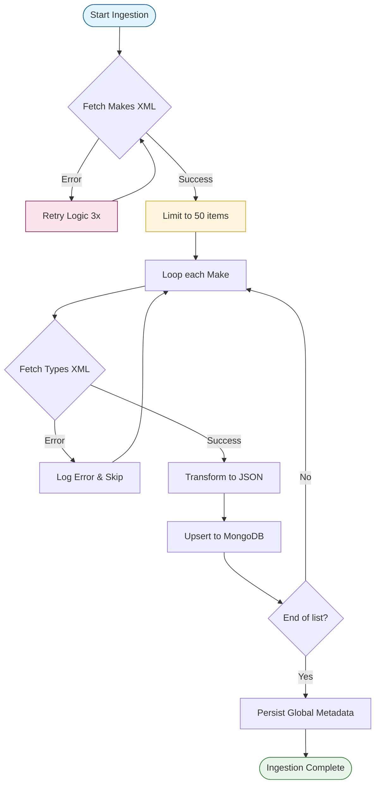

## Backend-InsightGlobal-Application

This project is a backend application built with NestJS. It implements a data ingestion pipeline that transforms XML data from public APIs into a unified JSON structure, stored in MongoDB and exposed via GraphQL.

## Overview

- Data Persistence: Uses MongoDB to store transformed vehicle data with optimized indexing.
- Ingestion Logic: During the ingestion process, the service fetches makes and types, performing an upsert to ensure the dataset is always up to date and consistent.
- API Layer: A read-only GraphQL API serves the stored data, ensuring high performance and type safety for client queries.
- CI/CD: Integrated GitHub Actions pipeline for automated linting, testing, and containerization.

## Tech Stack
- Framework: NestJS (Node.js)
- Language: TypeScript
- Database: MongoDB (Mongoose)
- API: GraphQL (Apollo)
- Validation: Zod (Configuration validation)
- Logging: Pino (Structured JSON Logs)
- CI: GitHub Actions

### Engineering Documentation
1. Ingestion Pipeline
The service follows a Fetch-Transform-Persist pattern:
- Fetch: Pulls raw XML from NHTSA endpoints.
- Transform: Parses XML using xml2js and maps it to TypeScript interfaces. It combines Make data with Vehicle Type data into a single unified object.
- Persist: Uses a split-storage strategy. Individual makes are stored in the VehicleMake collection to avoid MongoDB's 16MB document limit, while global metadata is stored in VehicleData.

2. Error Handling Strategy
- Network Resilience: Implements a retry mechanism (max 3 attempts) for external XML API calls.
- Graceful Failures: Failures in specific "Make" enrichments are logged, but do not stop the entire ingestion process.
- Startup Validation: Configuration errors (missing .env keys) trigger immediate process exit with clear error reporting.

3. Logging Strategy
The application uses Structured JSON Logging. This allows for better observability and log aggregation in production environments (like ELK or Datadog).

4. CI Pipeline
The project includes a GitHub Actions workflow that triggers on every push or PR to main:
Linting: Ensures code follows the established style guide.
Testing: Executes the unit test suite to prevent regressions.
Build: Verifies the production build and generates a Docker image.

## How to Run the Application
Prerequisites

Make sure you have the following installed on your machine:

- Node.js (v18 or later recommended)
- npm
- Docker and Docker Compose (for running MongoDB)

## 1-Clone Repository
git clone <repository-url>
cd backend-insightglobal-application

## 2-Configure Environment Variables
ensure you have a .env file with the correct variables

#### as reference check .env-example

***If running via Docker Compose, use MONGODB_URI=mongodb://vehicle-mongodb:27017/vehicle_db".

## 3-Start MongoDB
you can use a local MongoDB installation.

## 4-Install dependencies
npm install

## 5-Run Locally (Development)
# Start MongoDB via Docker
docker-compose up -d mongodb

# Run in dev mode
npm run start:dev

## 6-Run via Docker (Recommended)
docker-compose up --build

## 7-Access GraphQL
http://localhost:4000/graphql
Schema: Data is served directly from the persistent datastore.

## Example query:
```graphql
query {
  vehicles {
    identifier
    totalMakes
    lastUpdated
    makes {
      makeId
      makeName
      vehicleTypes {
        typeId
        typeName
      }
    }
  }
}


## Running Tests
# Unit tests
npm run test

# Linting
npm run lint

## Ingestion Pipeline Architecture
